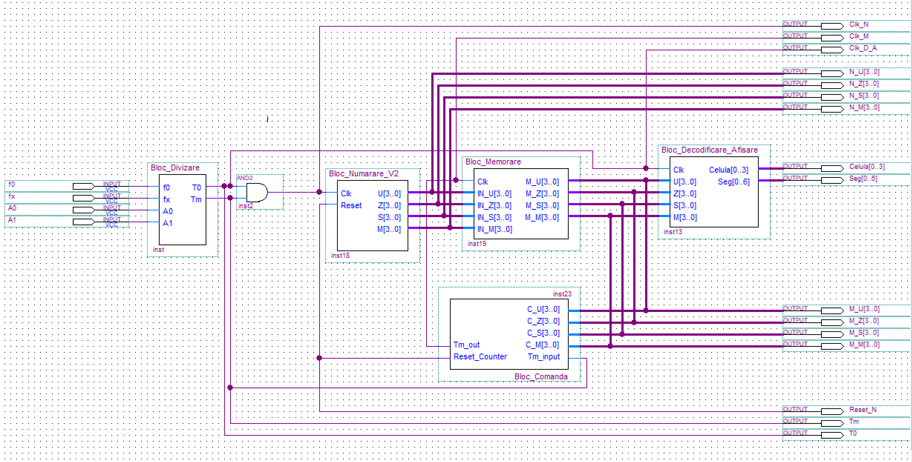

# Numerical Period Meter

This project implements a numerical period meter designed to measure time intervals with high precision. The system is based on a 12.96 MHz input etalon and includes a division block that outputs a 10 kHz signal. The meter supports multiple measurement modes, selectable via 2 input selection bits. The implementation uses the `Bloc_Numarare_V2` for counting and measurement.

## Features

- **Input Frequency**: 12.96 MHz etalon.
- **Division Block Output**: 10 kHz signal.
- **Measurement Modes**:
  - `Tm = Tx` (Single period measurement)
  - `Tm = 10Tx` (10 periods measurement)
  - `Tm = 100Tx` (100 periods measurement)
  - `Tm = 1000Tx` (1000 periods measurement)
- **Selection Bits**: 2 input bits to select the desired measurement mode.

## Components

The project is implemented using the following key components:

- **Counting and Measurement**:
  - `Bloc_Numarare_V2.bdf` / `Bloc_Numarare_V2.bsf`: Enhanced counting block for precise period measurement.

- **Division Blocks**:
  - `Div_10.bdf` / `Div_10.bsf`: Division by 10.
  - `Div_16.bdf` / `Div_16.bsf`: Division by 16.
  - `Div_1296.bdf` / `Div_1296.bsf`: Division by 1296.
  - `Div_10k.bsf`: Division to achieve 10 kHz output.

- **Decoding and Display**:
  - `Bloc_Decodificare_Afisare.bdf` / `Bloc_Decodificare_Afisare.bsf`: Decoding and display block for visualizing results.

## Usage

1. **Input Signal**: Provide a 12.96 MHz signal to the input etalon.
2. **Select Measurement Mode**: Use the 2 selection bits to choose the desired measurement mode:
   - `00`: `Tm = Tx`
   - `01`: `Tm = 10Tx`
   - `10`: `Tm = 100Tx`
   - `11`: `Tm = 1000Tx`
3. **Output**: The division block will output a 10 kHz signal, and the measurement results will be displayed.

## File Structure

The project files are located in the `Components/` directory. The primary counting block used is `Bloc_Numarare_V2`. Refer to the specific files for detailed implementation:

- [Bloc_Numarare_V2.bdf](Components/Bloc_Numarare_V2.bdf)
- [Div_10.bdf](Components/Div_10.bdf)
- [Div_1296.bdf](Components/Div_1296.bdf)
- [Bloc_Decodificare_Afisare.bdf](Components/Bloc_Decodificare_Afisare.bdf)

## Notes

- Ensure the input signal is stable and accurate to achieve precise measurements.
- The system is designed for educational and experimental purposes.

## License

This project is open-source and available for use under the MIT License.